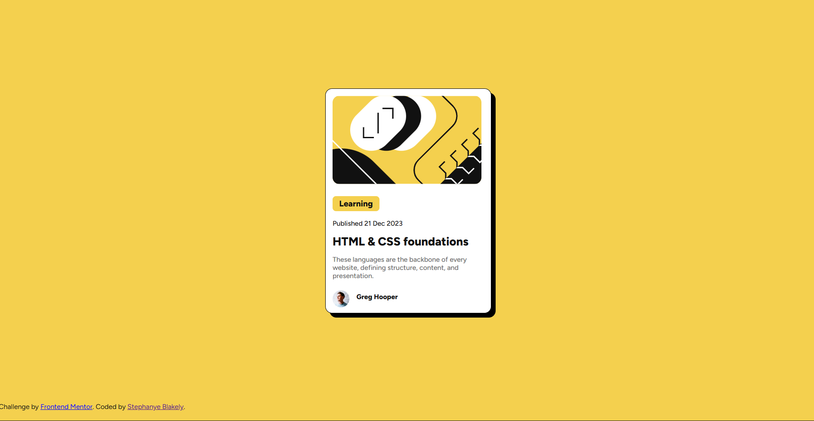

# Frontend Mentor - Blog preview card solution

This is a solution to the [Blog preview card challenge on Frontend Mentor](https://www.frontendmentor.io/challenges/blog-preview-card-ckPaj01IcS). Frontend Mentor challenges help you improve your coding skills by building realistic projects. 

## Table of contents

- [Overview](#overview)
  - [The challenge](#the-challenge)
  - [Screenshot](#screenshot)
- [My process](#my-process)
  - [Built with](#built-with)
  - [What I learned](#what-i-learned)
  - [Useful resources](#useful-resources)
- [Author](#author)

**Note: Delete this note and update the table of contents based on what sections you keep.**

## Overview

### The challenge

Users should be able to:

- See hover and focus states for all interactive elements on the page

### Screenshot



## My process

### Built with

- Semantic HTML5 markup
- CSS custom properties
- Flexbox
- CSS Grid
- Mobile-first workflow
- [React](https://reactjs.org/) - JS library
- [Next.js](https://nextjs.org/) - React framework
- [Styled Components](https://styled-components.com/) - For styles

### What I learned

I learned how to do more complex card styling with this exercise. I also as not previously aware that cards have focus and hover states the way that buttons do and learned that through doing this exercise.

To see how you can add code snippets, see below:

```css
.card {
    background-color: white;
    width: 384px;
    height: 522px;
    display: flex;
    gap: 1rem;
    flex-direction: column;
    justify-content: flex-start;
    border-radius: 1rem;  
}
.card:hover,
.card:focus {
    box-shadow: 10px 10px black;
    border: 1px black;
    border-style: solid;  
}
```
### Useful resources

- [Flexbox Froggy](https://flexboxfroggy.com/) - This helped me better understand Flexbox for this project.

## Author

- Website - [Stephanye Blakely](https://www.stephanyeblakely.com)
- Frontend Mentor - [@sblakely01](https://www.frontendmentor.io/profile/sblakely01)
- LinkedIn - [Stephanye-Blakely](https://www.linkedIn.com/in/stephanye-blakely)
